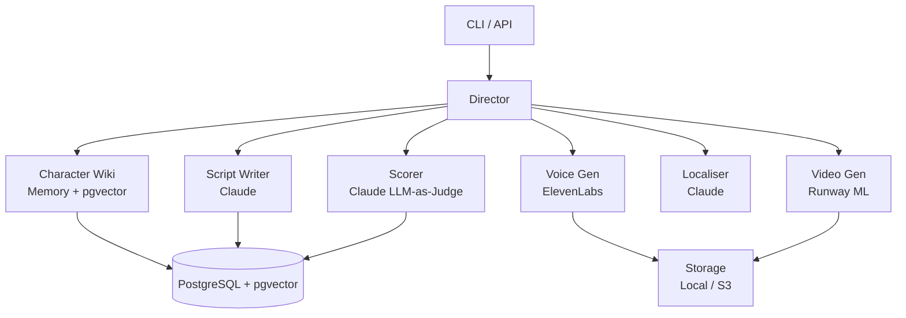

# Memo Claw

AI-powered content pipeline that generates, scores, and publishes animated character episodes. It uses Claude for script writing and quality scoring, ElevenLabs for voice generation, and Runway ML for video generation — all orchestrated through a stateful Director loop with retry logic and memory-augmented character consistency.

## Architecture



## Setup

```bash
# 1. Clone and enter project
cd memo-claw

# 2. Copy env and add your API keys
cp .env.example .env

# 3. Start PostgreSQL with pgvector
make up

# 4. Install dependencies
poetry install

# 5. Run database migrations
make migrate

# 6. Seed characters and formats
make seed

# 7. Run the API server
make run
```

## CLI Usage

```bash
# Run a single episode
memo-claw run --character "super-claws" --question "Why did you destroy the city?" --format "Super Claws Interrogation"

# Batch run from file
memo-claw batch --character "super-claws" --questions-file questions.txt --format "Super Claws Interrogation"

# Check job status
memo-claw status --job-id <uuid>

# List characters
memo-claw characters

# Seed the database
memo-claw seed

# View memory entries
memo-claw memory --character "super-claws" --last 10
```

## API Endpoints

| Method | Path | Description |
|--------|------|-------------|
| POST | `/jobs` | Create a new episode job |
| GET | `/jobs/{job_id}` | Get job status and details |
| GET | `/jobs` | List jobs (filter by status, character) |
| POST | `/jobs/{job_id}/advance` | Manual QA override |
| GET | `/characters` | List all characters |
| GET | `/characters/{id}/memory` | Get character memory entries |
| POST | `/characters/{id}/memory` | Add manual memory entry |
| GET | `/scorecards` | List scorecards |
| GET | `/health` | Health check |

## Running Tests

```bash
# Unit tests (mocked APIs)
make test

# Integration test (requires API keys + docker)
ANTHROPIC_API_KEY=sk-... python -m pytest tests/test_first_run.py -v
```

## What's Next

- **Temporal integration** — replace asyncio task with durable Temporal workflows
- **Video QA analysis** — frame-by-frame artefact detection and quality scoring
- **Dashboard** — web UI for monitoring jobs, reviewing scripts, approving QA
- **Post-publish analytics** — track engagement metrics and feed back into memory
- **Multi-platform publishing** — YouTube Shorts, TikTok, Instagram Reels
- **Voice cloning consent pipeline** — proper consent verification workflow
